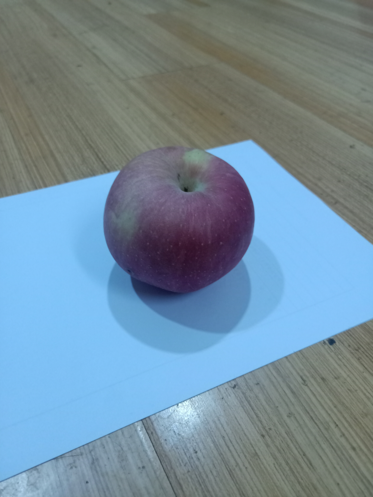

# NeRF
手机拍摄构建物体数据集，使用NeRF进行三维重建

## 示例图片
<p align="center">
  
</p>

## 3D重建结果
<p align="center">
  
</p>

## 训练的准备工作

### 自建数据集

拍摄的物体图片压缩包   https://pan.baidu.com/s/13DWlJgmLqqrlGUWiJMqRYw?pwd=kp7b

注意解压后所有图片放在 "./data/COLMAP_test/images/" 路径下   

### 生成位姿和点云
```
python imgs2poses.py "./data/COLMAP_test"
```

### Install requirements:
```
pip install -r requirements.txt
```

### 更改配置文件
打开 ./configs/COLMAP_test.txt 进行更改, 由于使用的是自建数据集，因此需将`dataset_type` 设置为 `llff`.

## 训练
```
python run_nerf.py --config configs/COLMAP_test.txt
```
It will create an experiment directory in `./logs`, and store the checkpoints and rendering examples there.

## 测试
Once you have the experiment directory (downloaded or trained on your own) in `./logs`, 
- to render a video:
```
python run_nerf.py --config configs/COLMAP_test.txt --render_only
```
The video would be stored in the experiment directory.


